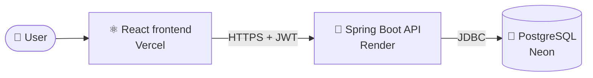
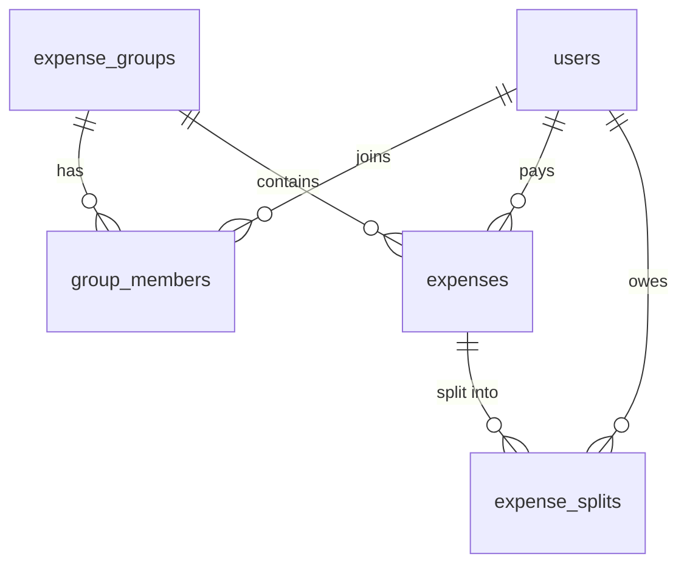

<div align="center">


<p>
  <a href="https://settle-up-henna-seven.vercel.app"></a>
  <a href="https://github.com/Anubhutisharma-07/SettleUp"></a>
</p>

<p>
  
  
  
  
  
  
  
  
</p>

**Split group expenses. See who owes whom. Settle up in the fewest payments possible.**

</div>

> ⏳ The backend runs on a free tier, so the first request after a quiet period can take 30 to 60 seconds while the server wakes up.

<br>

<div align="center">
  
</div>

---

## 📖 Contents

[Screenshots](#-screenshots) · [Features](#-features) · [Security](#-security) · [Tech stack](#-tech-stack) · [Architecture](#-architecture) · [Getting started](#-getting-started) · [API](#-api-reference) · [Deployment](#-deployment) · [Roadmap](#-roadmap)

---

## 🖼️ Screenshots

<table>
  <tr>
    <td width="50%"><br><sub><b>Dashboard.</b> Your total balance, money flows and settlement network.</sub></td>
    <td width="50%"><br><sub><b>Groups and activity.</b> Every group at a glance, plus a live activity feed.</sub></td>
  </tr>
  <tr>
    <td width="50%"><br><sub><b>Expenses.</b> Add a bill in seconds; payers are shown by name.</sub></td>
    <td width="50%"><br><sub><b>Settle Up.</b> The minimum set of payments that clears every debt.</sub></td>
  </tr>
</table>

<details>
<summary><b>Sign-up screen</b></summary>
<br>

</details>

---

## ✨ Features

| | |
| --- | --- |
| 🔐 **Secure accounts** | Sign up and log in with BCrypt-hashed passwords and JWT tokens |
| 👥 **Groups and roles** | The creator becomes `ADMIN`; everyone else is a `MEMBER` |
| 🔎 **Add people by name** | Admins search by name (3+ characters, up to 8 results) and add with one click. No user IDs |
| 🧾 **Expenses** | Record who paid and how much; the cost is split equally across the group |
| ⚖️ **Live balances** | See who owes and who is owed, with real names |
| 🧮 **Minimum-transaction settlement** | Reduces every balance to the fewest payments needed |
| 📊 **Personal dashboard** | Total you owe, who you pay and who pays you, and a settlement network graph across all your groups |
| 🕘 **Activity feed** | A running list of the latest expenses across your groups |
| 🙋 **Profile menu** | Shows who is logged in, with logout |
| 🌗 **Dark and light mode** | Switch themes from the UI |

---

## 🛡️ Security

Security is the part of this project I care about most, and it started with a bug I found in my own app.

> **The bug.** I logged in as a second user and could read another group's balances just by guessing the group ID. The server checked *who* you were, but not whether you were *allowed* to see that group.
>
> **The fix.** I reproduced it first, then added membership checks to every group and expense endpoint. Non-members now get `403`, and I re-ran the exact same request to confirm.

Other protections:

- 🔒 **Admin-only actions:** member search and adding members need the group `ADMIN` role
- 💉 **Safe search:** parameterised queries, and `%` and `_` are escaped, so a search for `%%%` matches literal text instead of every user
- 🚪 **Default deny:** only `/api/health` and the auth endpoints are public; everything else needs a valid token
- 🔑 **No secrets in git:** config comes from environment variables, `.env` is gitignored and `.env.example` documents what is needed
- 🙈 **No password hashes** in any API response
- ❌ **Proper `401`** on a failed login, not a `200` with an error body

---

## 🧰 Tech stack

| Layer | Technology |
| --- | --- |
| **Backend** | Java 21, Spring Boot, Spring Security, Spring JDBC (no ORM) |
| **Database** | PostgreSQL 16 |
| **Auth** | JWT, BCrypt |
| **Frontend** | React (Create React App), Tailwind CSS |
| **Containers** | Docker, Docker Compose (Postgres, backend, frontend on nginx) |
| **CI** | Jenkins, via the root `Jenkinsfile` |
| **Hosting** | Render (API), Vercel (frontend), Neon (database) |

> 💡 **Why plain JDBC?** On purpose: every query is hand-written, so I know exactly what runs against the database.

---

## 🏗️ Architecture



### Database



Money is stored as `NUMERIC(12,2)` with `CHECK` constraints, and equal shares are rounded `HALF_UP`. The schema uses `CREATE TABLE IF NOT EXISTS`, so it is safe to run more than once.

<details>
<summary><b>📁 Project structure</b></summary>

```text
SettleUp/
├── settleup/                 # Spring Boot backend
│   ├── src/main/java/com/settleup/
│   │   ├── controller/       # REST controllers: auth, groups, expenses, users, health
│   │   ├── service/          # business logic, access checks, settlement algorithm
│   │   ├── repository/       # JDBC data access
│   │   ├── dto/              # request and response objects
│   │   ├── entity/
│   │   └── exception/        # e.g. ForbiddenException mapped to 403
│   ├── src/main/resources/schema.sql
│   └── Dockerfile
├── frontend/                 # React + Tailwind app
├── docker-compose.yml
├── Jenkinsfile
└── .env.example
```

</details>

---

## 🚀 Getting started

### Option 1: Docker Compose (easiest)

```bash
git clone https://github.com/Anubhutisharma-07/SettleUp.git
cd SettleUp
cp .env.example .env        # then set POSTGRES_PASSWORD and JWT_SECRET
docker compose up --build
```

Then open **http://localhost:3000**. The API runs at http://localhost:8080.

### Option 2: Run each part yourself

Needs Java 21, Node 20 and a running PostgreSQL with `settleup/src/main/resources/schema.sql` loaded.

```bash
# Backend
cd settleup
./mvnw spring-boot:run

# Frontend (new terminal)
cd frontend
npm ci
npm start
```

<details>
<summary><b>⚙️ Configuration variables</b></summary>

Everything has a local-friendly default, so nothing changes unless you set it.

| Variable | Purpose |
| --- | --- |
| `DB_HOST`, `DB_PORT`, `DB_NAME`, `DB_USERNAME`, `DB_PASSWORD` | Database connection |
| `DB_SSLMODE` | Optional SSL for managed databases such as Neon |
| `JWT_SECRET` | Secret used to sign tokens. Use a long random value |
| `JWT_EXPIRATION_MS` | Token lifetime (default 24 hours) |
| `CORS_ALLOWED_ORIGINS` | Comma-separated list of allowed frontend origins |
| `PORT` | Backend port (default 8080) |
| `REACT_APP_API_URL` | API base URL, baked in at frontend build time |

</details>

### 🧪 Run the tests

```bash
cd settleup
./mvnw clean test
```

The suite has 6 tests, including the settlement algorithm. The startup test needs PostgreSQL running. For the frontend, `CI=true npm run build` must finish with zero warnings.

---

## 📡 API reference

All endpoints except auth and health need `Authorization: Bearer <token>`.

| Method | Endpoint | Description |
| --- | --- | --- |
| `GET` | `/api/health` | Public health check |
| `POST` | `/api/auth/signup` | Create an account |
| `POST` | `/api/auth/login` | Log in, returns `{token, userId, name, email}`. `401` on bad credentials |
| `GET` | `/api/users/me` | The logged-in user |
| `GET` | `/api/users/search?q=&groupId=` | Find users to add (group admin only, `q` 3+ characters) |
| `GET` | `/api/groups` | Your groups |
| `POST` | `/api/groups` | Create a group |
| `GET` | `/api/groups/{id}/members` | Members with names and roles |
| `POST` | `/api/groups/{id}/members` | Add a member (admin only) |
| `GET` | `/api/groups/{id}/expenses` | Expenses with payer names |
| `POST` | `/api/groups/{id}/expenses` | Add an expense |
| `GET` | `/api/groups/{id}/balances` | Net balance per member |
| `GET` | `/api/groups/{id}/settlements` | Fewest payments needed to settle |

Non-members get `403` on every group endpoint.

---

## ☁️ Deployment

| Part | Service | Notes |
| --- | --- | --- |
| 🗄️ Database | **Neon** | Load `schema.sql` once |
| 🍃 Backend | **Render** (Docker web service from `settleup/Dockerfile`) | Set the `DB_*`, `JWT_SECRET`, `CORS_ALLOWED_ORIGINS` and `PORT` variables |
| ⚛️ Frontend | **Vercel** (root directory `frontend`) | Set `REACT_APP_API_URL` to the backend URL |

> ⚠️ `CORS_ALLOWED_ORIGINS` must hold the exact Vercel URL with no trailing slash, or the browser blocks every request.

The backend Dockerfile sets `-XX:MaxRAMPercentage=70 -XX:+UseSerialGC` so the JVM fits comfortably in Render's 512 MB free tier.

### 🔁 CI

The root `Jenkinsfile` builds both halves: the backend is compiled, tested and packaged with Maven, and the frontend is installed with `npm ci` and built.

---

## 🗺️ Roadmap

- [x] Auth with JWT and BCrypt
- [x] Groups, roles and name-based member search
- [x] Equal-split expenses and balances
- [x] Minimum-transaction settlement
- [x] Access control on all group endpoints
- [x] Docker Compose, Jenkins CI and live deployment
- [ ] More split types (exact amounts, percentages)
- [ ] Edit and delete expenses
- [ ] Tests for the API layer

---

## 👩‍💻 Author

**Anubhuti Sharma**: second-year student, looking for backend / SDE internships.

[](https://github.com/Anubhutisharma-07)

<div align="center">

If you try the app, I'd love your feedback. ⭐ a star is always appreciated!

</div>
